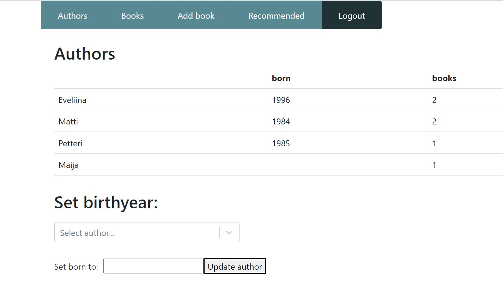

# Library-App
Used technologies:
- React
- Node
- GraphQL
- ApolloServer
- MongoDB & mongoose
- GraphQL & Apollo Client

In this app you can list your favourite books, view the authors and get recommendations based on your favourite genre. This app is assignment from Full Stack open -course.
